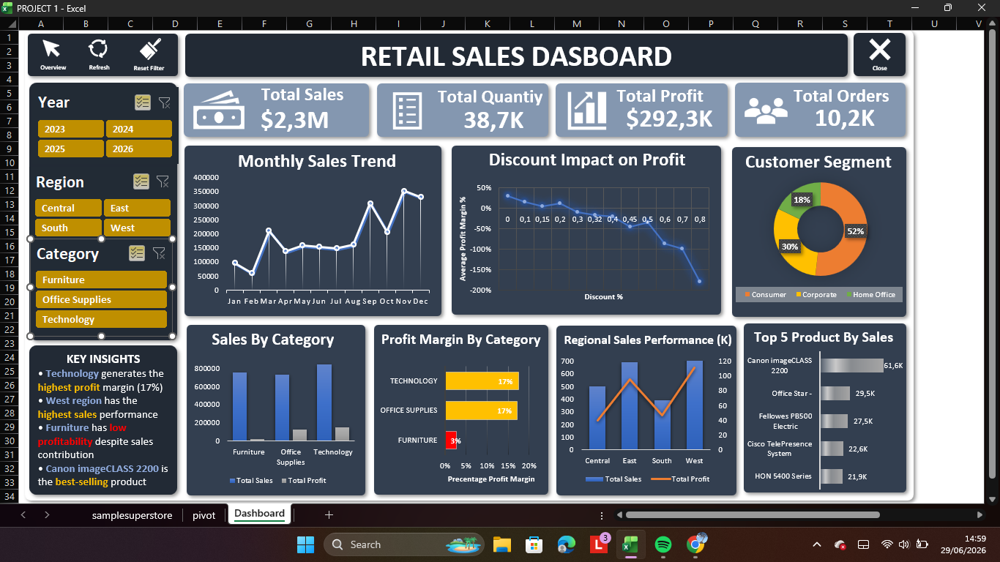

# retail-sales-excel-dashboard
Interactive Retail Sales Dashboard built using Microsoft Excel, Power Query, Pivot Table, and Pivot Chart.
## Tools Used

- Microsoft Excel
- Power Query
- Pivot Table
- Pivot Chart
- Slicer

## Dashboard Features

- Sales performance analysis
- Profitability analysis
- Regional sales comparison
- Product ranking
- Customer segment analysis
- Discount impact analysis

## Key Insights

- Technology category achieved the highest profit margin.
- West region showed strong sales performance.
- Higher discounts negatively impacted profitability.
- Canon imageCLASS 2200 was the top-selling product.

## Dashboard Preview

